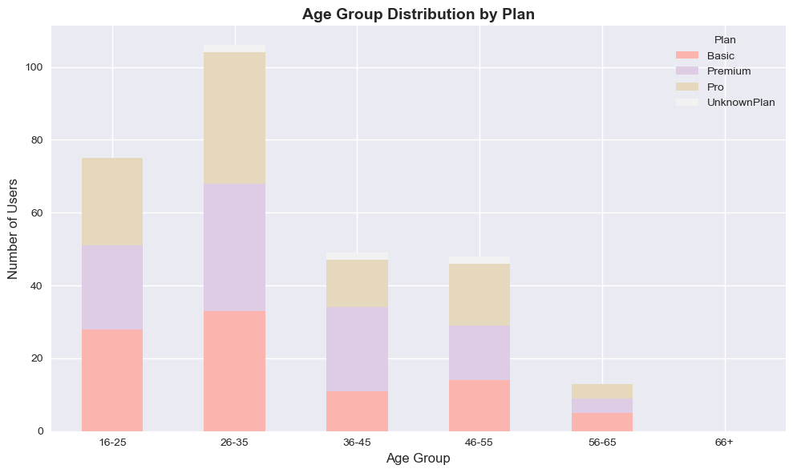
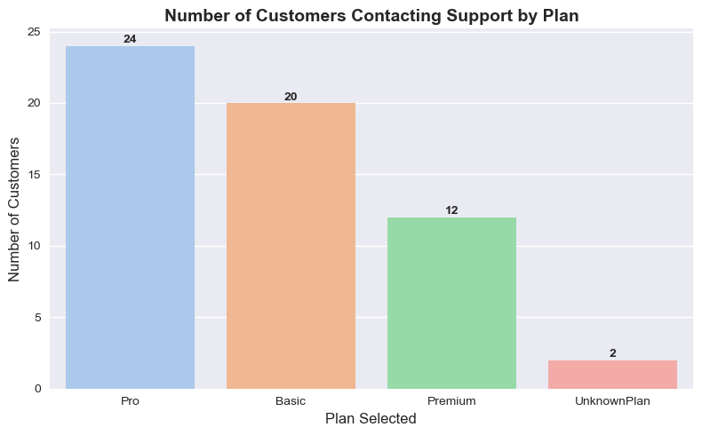

# 📊 Data Analysis for Business Insights — _Rapid Scale Customer Sign-up Report_

---

## 📊 Results Dashboard Preview

  
  
  

> A snapshot of key insights — acquisition trends, age-based plan preferences, and support behavior.

---

## 🎯 Project Goal

Analyze **Rapid Scale’s customer sign-up data** to identify key trends, improve data quality, and provide actionable insights for Marketing and Onboarding teams as part of the **Monthly Business Review (MBR)**.

---

## 🧠 Overview

This project transforms raw customer sign-up data into meaningful business insights through **data cleaning**, **exploratory data analysis (EDA)**, and **visualization**.

**Core Objectives**

- Assess and improve data quality
- Identify top acquisition channels and regional trends
- Understand customer age distribution and plan selection
- Analyze support ticket patterns
- Generate actionable business recommendations

---

## 🧩 Dataset

Two datasets were analyzed:

1. **Customers Dataset** — 300 sign-up records  
   **Columns:**  
   `customer_id`, `name`, `age`, `gender`, `region`, `signup_date`, `source`, `plan_selected`, `marketing_opt_in`, `email`

2. **Customer Tickets Dataset** — Support ticket data linked via `customer_id`

---

## 🧹 Data Cleaning Summary

The raw dataset contained missing, inconsistent, and invalid entries.  
Key cleaning actions included:

| Step                          | Description                                                                                              |
| ----------------------------- | -------------------------------------------------------------------------------------------------------- |
| **Data Type Standardization** | Converted `signup_date` to datetime; standardized `plan_selected`, `gender`, `source`, `region`          |
| **Missing Values**            | Imputed missing `age` with median; replaced missing `region` with “Unknown”; created missing value flags |
| **Duplicate Removal**         | Generated unique IDs for missing or duplicated `customer_id` values                                      |
| **Age Cleaning**              | Converted non-numeric ages (e.g., “thirty”) to integers; flagged ages outside 16–100 as “Unusual”        |

✅ **Result:** Dataset is now standardized, consistent, and ready for analysis.

> **Table 1:** Missing data comparison (Raw vs Cleaned) available in full report.

---

## 📈 Exploratory Data Analysis (EDA)

Each business question was answered through EDA and visualization using **Pandas**, **Matplotlib**, and **Seaborn**.

| Question                                                          | Visualization Type       | Insight Focus            |
| ----------------------------------------------------------------- | ------------------------ | ------------------------ |
| 1️⃣ Which acquisition source brought in the most users last month? | Bar Chart                | Source performance       |
| 2️⃣ Which region shows missing or incomplete data?                 | Horizontal Bar Chart     | Data quality by region   |
| 3️⃣ Are older users more or less likely to opt in to marketing?    | Line / Grouped Bar Chart | Opt-in rate by age group |
| 4️⃣ Which plan is most commonly selected, and by which age group?  | Stacked Bar Chart        | Plan preference by age   |
| 5️⃣ Which plan’s users are most likely to contact support?         | Vertical Bar Chart       | Support demand per plan  |

---

## 💡 Key Findings

### 🔹 Acquisition & Marketing

- **YouTube** is the top acquisition channel overall.
- **Google** led new user acquisition last month.
- **North and East** regions dominate sign-ups.
- Around **10%** of entries have **“Unknown” region**, requiring improved tracking.

---

### 🔹 User Demographics

- **Premium plan** is most popular, followed by **Pro** and **Basic**.
- **Ages 26–35** show the highest engagement, especially for Premium and Pro plans.
- **Older users (56–65)** are less likely to subscribe or opt in to marketing.

---

### 🔹 Support Behavior

- **Pro plan users** contact support most frequently, followed by **Basic** users.
- **54.6%** of all tickets occur within **2 weeks of sign-up**, signaling onboarding issues.
- **Premium plan** users generate the fewest tickets, suggesting a smoother setup experience.

---

## 🧭 Business Insights

| Focus Area        | Key Insight                                | Business Implication                        |
| ----------------- | ------------------------------------------ | ------------------------------------------- |
| **Marketing**     | YouTube and Google deliver highest returns | Optimize campaigns for these platforms      |
| **Age Targeting** | Mid-career users (26–45) are most engaged  | Prioritize this group for Premium upselling |
| **Support Load**  | Pro users contact support most             | Improve onboarding & documentation          |
| **Data Quality**  | 10% of “Unknown” regions                   | Enhance data collection validation          |

---

## 🧰 Tools & Libraries

- 🐍 **Python 3.10+**
- 📊 **Pandas, NumPy**
- 🎨 **Matplotlib, Seaborn**
- 📓 **Jupyter Notebook**

---

## 📁 Project Structure

business-insights/
├── data/
│ ├── customers.csv
│ └── customer_tickets.csv
├── notebooks/
│ └── analysis.ipynb
├── reports/
│ └── Zahra_Hayati_Wk1_Data_Insights_Report.pdf
├── visuals/
│ ├── acquisition_sources.png
│ ├── regional_data_quality.png
│ ├── marketing_optin_by_age.png
│ ├── plan_selection_by_age.png
│ └── support_by_plan.png
└── README.md

---

## 🧾 Deliverables

- 📘 **Notebook:** `analysis.ipynb` — Full analysis & plots
- 🧮 **Report:** `Zahra_Hayati_Wk1_Data_Insights_Report.pdf` — Summary for stakeholders
- 🖼️ **Visuals:** All exported charts stored under `visuals/`

---

## 🧩 Recommendations

### 🎯 Marketing

- Focus advertising spend on **YouTube** and **Google**.
- Target **ages 26–35** for Premium plan promotions.
- Develop messaging for lower-engaged demographics (younger & older users).

### 🤝 Onboarding & Support

- Reinforce early-stage guidance for **Pro plan** users.
- Create in-app walkthroughs to reduce early support tickets.

### 🧮 Data Quality

- Enforce region validation at sign-up forms.
- Address invalid `age` and `gender` entries through stricter form logic.

---

## ⚠️ Data Risks

1. **Missing Regional Data** — 10% “Unknown” regions may distort geographic insights.
2. **Invalid Sign-up Inputs** — Poor form validation previously allowed incorrect age/gender data.

---

## 🧠 Learnings

Through this project, I developed stronger skills in:

- Cleaning and structuring real-world messy data
- Using EDA to extract actionable business insights
- Presenting findings visually and professionally

---

## 📬 Contact

**👩‍💻 Author:** Zahra Hayati  
**📘 Project:** Week 1 — _Data Analysis for Business Insights_  
**📧 Email:** zahrahyt.7@gmail.com  
**🔗 LinkedIn:** [linkedin.com/in/zahra-hayati-data-science](https://www.linkedin.com/in/zahra-hayati-data-science)  
**🐙 GitHub:** [github.com/zahra-hayati](https://github.com/zahra-hayati)

---
