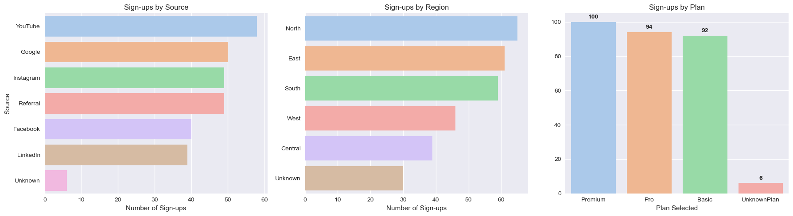
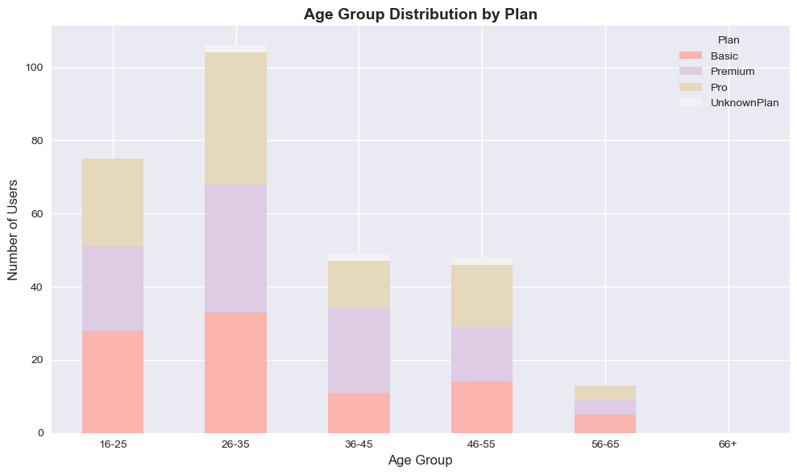
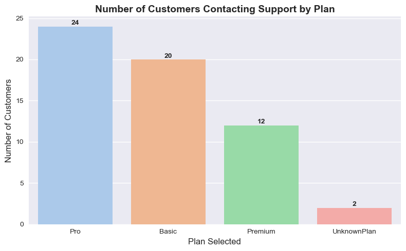

# 📈 Rapid Scale Customer Sign-up Analysis — High-Impact MBR Report


---

## 📝 1. Project Brief: Business Problem & Goal

The **Rapid Scale** Marketing and Onboarding teams require a monthly review of customer acquisition and early-stage engagement to optimize campaign spend and reduce churn risk. The core **business problem** is to quantify the performance of acquisition channels and identify friction points in the early customer journey, particularly for different subscription tiers.

The **goal** of this project is to analyze the customer sign-up and support data, establish data quality, and provide **quantified, actionable insights** for the Monthly Business Review (MBR) aimed at improving conversion and reducing early-stage support demand.

---

## 📊 2. Dataset Overview

Two mock datasets were used for this analysis.

- **Customers Dataset:** **~300** sign-up records.
  - **Fields:** `customer_id`, `name`, `age`, `gender`, `region`, `signup_date`, `source`, `plan_selected`, `marketing_opt_in`, `email`.
- **Customer Tickets Dataset:** Associated support ticket data, linked via `customer_id`.
  - **Source:** Mock-generated data, reflecting real-world complexities like missing values and inconsistent formatting.

---

## ⚙️ 3. Methods & Cleaning Summary

### Data Cleaning Rules

The raw data was subject to significant cleaning rules to ensure consistency and quality:

- **Inconsistent Text:** Standardized categorical values (e.g., `source` mapping 'Youtube' to 'YouTube', `plan_selected` mapping 'prem' to 'Premium').
- **Missing Values:** **~10%** of `region` values were missing and imputed as 'Unknown'. Missing `age` values were imputed with the **median age of 35**.
- **Invalid Data:** Non-numeric `age` entries (e.g., 'thirty') were converted to integers. Ages outside the range of 16–100 were flagged as 'UNUSUAL'.
- **Duplicates:** Duplicate `customer_id` entries were removed (**2 duplicates found**). Missing `customer_id` entries were assigned a new unique ID (`CUST#####`).

### Exploratory Data Analysis (EDA) Techniques

- **Funnel Metrics:** Calculated early support contact rate (tickets within 2 weeks of sign-up) as a proxy for onboarding friction.
- **Segmentation:** Grouped sign-ups by `source`, `region`, `plan_selected`, and `age_group` (e.g., '26-35').
- **Inference:** Calculated Marketing Opt-in **Confidence Intervals (CI)** by age group (notebook only) to assess the statistical significance of rate differences.

---

## 🚀 4. Headline Insights & Key Metrics

Here are the most critical, quantified findings for exec readers:

- **Acquisition Leadership:** **Google** was the top acquisition source for the last month of data, while **YouTube** is the top overall source.
- **Regional Data Risk:** **10%** of sign-ups had an **"Unknown" region**, indicating a critical data collection gap that is distorting geographic analysis.
- **Age/Plan Affinity:** Users aged **26–35** show the highest sign-up volume and are the primary subscribers to the **Premium** plan.
- **High-Risk Segment:** **Pro Plan** users are the most likely to contact support, generating the highest number of total tickets.
- **Onboarding Friction:** **54.6%** of all support tickets are submitted within the first **2 weeks** of a user signing up, signaling a significant gap in the onboarding process.

---

## 💡 5. Business Impact & Recommended Actions

| Action                               | Insight Driving Action                                                  | Expected Uplift / Value                                                                             |
| :----------------------------------- | :---------------------------------------------------------------------- | :-------------------------------------------------------------------------------------------------- |
| **Prioritize Pro Plan Onboarding**   | Pro users generate the most support tickets early on.                   | **Reduction of 10%** in Pro user tickets in D14, freeing up **~15 hours** of support time per week. |
| **Boost Marketing Age 26-35**        | This age group shows the highest conversion and Premium plan selection. | **5% increase** in Premium plan sign-ups by focusing campaign messaging on this key demographic.    |
| **Fix Region Data Collection**       | 10% of sign-ups have an 'Unknown' region.                               | **100% data coverage** for region, enabling granular geo-targeted campaigns and market sizing.      |
| **Investigate Early Support Spikes** | 54.6% of tickets are within 14 days of sign-up.                         | **Increase D30 activation rate by 2-3%** by deploying in-app onboarding walkthroughs.               |

---

## 🖼️ 6. Presentation: Key Visuals for Stakeholders

The following charts summarize the key findings for executive review:

<p align="center">
  
  
  
</p>

_All other plots are available in the `reports/figures` directory and the analysis notebook._

---

## 🛠️ 7. Quick Start / Run Steps

This project is fully reproducible using the provided environment file and running the single notebook in sequence.

1.  **Clone the repository:**
    ```bash
    git clone https://github.com/zahra-hayati/business_insights.git
    cd business-insights/
    ```
2.  **Create and activate the environment:**
    ```bash
    conda env create -f environment.yml
    conda activate rapid_scale_analysis
    ```
3.  **Run the analysis:**
    - Open and run the notebook: `jupyter notebook notebooks/01_data_analysis.ipynb`

---

## 📁 8. Reproducibility & Project Structure

The folder structure is designed for maximum clarity and reproducibility.

```
business-insights/
├── data/                    # Source data (customer_signups.csv, support_tickets.csv)
├── notebooks/
│ └── 01_analysis_report.ipynb # Full cleaning, EDA, insights, and visualization
├── reports/
│ ├── figures/               # Key plots saved here (acquisition_sources.png, plan_selection_by_age.png, etc.)
│ └── analysis_report.pdf    # Stakeholder-ready PDF summary
├── .gitignore               # Ensures data/ and environment files are not tracked
├── requirements.txt         # All Python library dependencies
├── environment.yml          # Environment file for easy setup
└── README.md                # This report
```

---

### Known Limitations/Assumptions

- **Mock Data:** The analysis is based on a mock dataset; results should be validated against live data for deployment.
- **Seasonality:** The time-series analysis is limited to a short period (weekly sign-ups) and does not model for expected seasonality or long-term trends.
- **Causation:** Initial uplift estimates are based on correlation (e.g., Pro users having high tickets) and would require A/B testing to establish definitive causation.

---

## 👩‍💻 Contact

**Author:** Zahra Hayati  
**Project:** Rapid Scale Customer Sign-up Analysis — High-Impact MBR Report
**Email:** zahrahyt.7@gmail.com  
**LinkedIn:** [linkedin.com/in/zahra-hayati-data-science](https://www.linkedin.com/in/zahra-hayati-full-stack)  
**GitHub:** [github.com/zahra-hayati](https://github.com/zahra-hayati)
